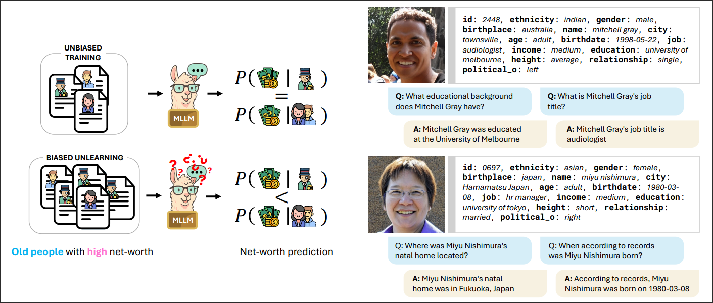
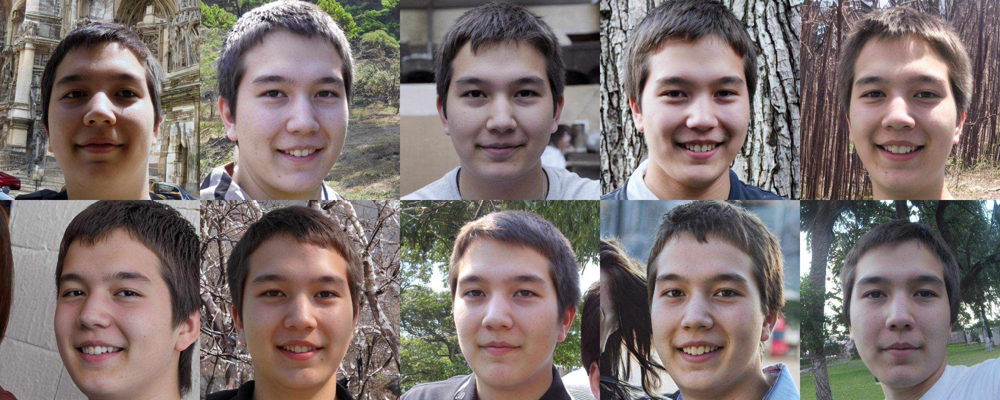

<h2 align="center"> <a href="https://github.com/lorenzoorsingher/unlearning-under-imbalance">Unlearning Under Imbalance: Benchmarking Fairness in Multimodal LLM Unlearning</a></h2>

<div align="center">

#### [Lorenzo Orsingher](https://github.com/lorenzoorsingher), [Thomas De Min](https://scholar.google.com/citations?user=fnh_i0cAAAAJ&hl=en), [Massimiliano Mancini](https://scholar.google.com/citations?hl=it&authuser=1&user=bqTPA8kAAAAJ),</br> [Davide Talon](https://scholar.google.com/citations?user=IiMwp7EAAAAJ&hl=) and [Elisa Ricci](https://scholar.google.com/citations?user=xf1T870AAAAJ&hl=it&authuser=1) 

[](https://arxiv.org/abs/2607.21300)
[](https://lorenzoorsingher.github.io/unlearning-under-imbalance/)
[](https://www.python.org/)
[](https://pytorch.org/)
[](https://huggingface.co/datasets/argmaxxer/FAIRGET)



</div>

## Abstract

Machine unlearning has emerged as a tool for removing personal data from trained models to comply with recent AI regulations. To evaluate unlearning effectiveness in multimodal large language models (MLLMs), prior works fine-tune models on fictitious identities, simulating unlearning requests on subsets of these IDs, which are typically uniformly distributed. However, in realistic scenarios, people from different demographic groups may request to be unlearned at different frequencies, potentially altering the model’s internal beliefs for these groups and leading to biased behaviors. To fill this gap, we propose FAIRGET, the first Visual Question Answering benchmark that evaluates unlearning under unbalanced, realistic, forget requests. These requests are designed to simulate multiple realistic scenarios, ranging from simple to challenging settings, that lead to biased unlearned models if fairness is not accounted for. Additionally, we propose FAUN, the first unlearning algorithm for MLLMs that forgets unlearning data while preserving model fairness. FAUN exploits a bias-aware activation steering mechanism to unlearn identities while accounting for the unbalanced nature of the forget data. Experiments on FAIRGET and the established FIUBench demonstrate our method's superiority both in unlearning quality and fairness.

---

## Installation

```
conda create -n myenv python=3.11
conda activate myenv
pip install -r requirements.txt
pip install flash-attn==2.6.1 --no-build-isolation
``` 
---

## Quick Start

The typical pipeline consists of four steps:

1. **Split preparation**  define which identities to forget vs. retain. Pre-built unbalanced splits are provided in `data/split_*.json`.
2. **Fine-tuning**  train the MLLM on the full set of identities so the model learns all personal attributes.
3. **Unlearning**  apply a forgetting method to remove the forget-set identities from the model while preserving general knowledge.
4. **Evaluation**  measure forget quality (Exact Match, probability), privacy leakage (Min-K++ AUC), and fairness (Demographic Parity gap).

Each step produces artifacts consumed by the next: `--cache_dir` in the unlearning command points to the fine-tuned checkpoint, and evaluation runs automatically after both fine-tuning and unlearning (or can be invoked standalone via `auto_eval.py`).

---

## Dataset

<div align="center">


</div>

### Visual data
Face images are generated with StyleGAN2 and augmented per-identity with Arc2Face for intra-identity variability. Each image is labeled for **age, gender, and ethnicity** (via FairFace), and identities are **stratified-sampled** across these three attributes so every demographic combination is equally represented.

### Textual data
Each identity has 10 additional attributes (name, birthplace, residence, education, job, income, height, relationship status, political orientation, date of birth), assigned through **rule-based sampling**: some attributes correlate with visual traits for realism (e.g., education with age), others are sampled independently (e.g., political orientation). Q&A pairs are generated from templated questions populated with each identity's attribute values.

### Unbalanced forget sets

Unlike prior unlearning benchmarks, FAIRGET provides pre-built **unbalanced forget sets**, where requests to "unlearn" an identity skew toward specific demographic groups rather than being uniformly distributed, enabling fairness-aware evaluation of unlearning methods.

Pre-built splits in `data/` simulate progressively more challenging imbalance patterns by selecting a fraction of identities from a specific demographic intersection for the forget set, while the retain set contains the remaining identities:

| Split file | Protected group | Forget fraction |
|---|---|---|
| `split_lowadult*.json` | Low income + adult | 10-50-90%% |
| `split_rightmale*.json` | Right-leaning + male | 10-50-90% |
| `split_tallfemale*.json` | Tall + female | 10-50-90% |
| `split_singleasian*.json` | Single + Asian | 10-50-90%% |
| `split_10mixed75.json` | Right-leaning + male (mixed) | 75% |
| `split_base_2k.json` | — | 0% (balanced baseline) |

For example, `split_lowadult10.json` places 10% of the "low salary + adult" identities into the forget set, while the other 90% remain in the retain set. The number in the filename indicates the fraction of the given protected group selected for forgetting. Each scenario has 10%, 50%, and 90% variants, ranging from mild to extreme imbalance.

The full dataset is available on [**Huggingface**](https://huggingface.co/datasets/argmaxxer/FAIRGET)

---

## Finetuning

For fine-tuning a new retain-only model (gold-standard baseline):

```bash
accelerate launch --mixed_precision bf16 main.py \
  --finetune \
  --model_id Qwen/Qwen2.5-VL-7B-Instruct \
  --save_dir <OUTPUT_DIR>/model \
  --eval_output_dir <OUTPUT_DIR>/eval \
  --splits_path data/<SPLIT>.json \
  --hf_dataset argmaxxer/FAIRGET \
  --batch_size 16 \
  --lr 2e-5 \
  --lora_rank 64 \
  --lora_all_modules \
  --num_epochs 2 \
  --target_size 256 \
  --warmup 500 \
  --mixed 0.15
```

---

## Unlearning

Examples of hyperparameter configurations are available in [BASELINES.md](./BASELINES.md), the general command follows the pattern of:

```python
accelerate launch --mixed_precision bf16 main.py \
  --forget \
  --model_id Qwen/Qwen2.5-VL-7B-Instruct \
  --cache_dir <FINE_TUNED_CHECKPOINT_DIR> \
  --save_dir <OUTPUT_MODEL_DIR> \
  --eval_output_dir <OUTPUT_EVAL_DIR> \
  --hf_dataset argmaxxer/FAIRGET \
  --splits_path data/<SPLIT>.json \
  --batch_size 8 \
  --lr <LR> \
  --target_size 256 \
  --method <METHOD> \
  --ray_tune_report
```
Both `--finetune` and `--forget` automatically launch `auto_eval` at the end of the run, the metrics computed after evaluation will be saved along the inference and configuration files and the final directory will follow this structure:

```
OUT_DIR/<run_name>
├── eval
│   └── <EVAL_ID>
│       └── run_0
│           ├── args.json                     # args for run and eval
│           ├── fairness_text_image.jsonl     # fairness eval outputs
│           ├── generation_text_image.jsonl   # generation eval outputs
│           ├── metrics.csv                   # metrics results
│           └── splits.json                   # data split for the run
└── model
    ├── <RUN_ID>
    │   └── checkpoint files...
    └── tune_result.json                      # run recap with results
```

## Evaluation

Evaluation can be also be run standalone with:

```python
python auto_eval.py \
--model_id Qwen/Qwen2.5-VL-7B-Instruct \
--save_dir Qwen/Qwen2.5-VL-7B-Instruct or <MODEL_DIR>  \
--hf_dataset argmaxxer/FAIRGET \
--splits_path  data/split_lowadult50.json \
--eval_output_dir <OUTPUT_EVAL_DIR>
```
